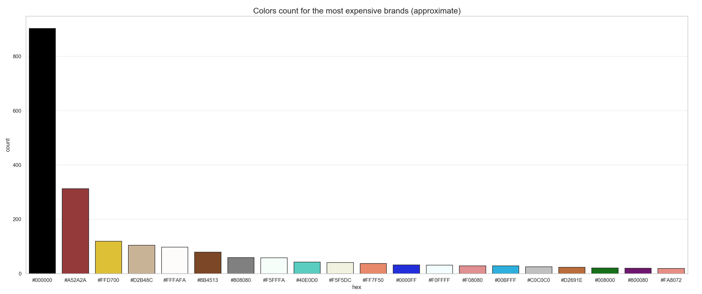
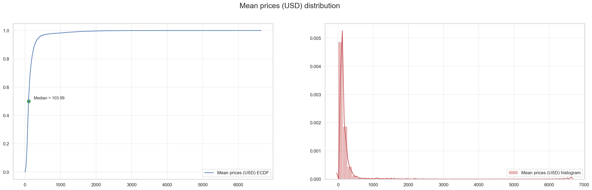

# Exploratory Data Analysis - Women's Shoes Prices

The purpose of this project is to study the `Women's Shoes Prices` dataset, which contains a list of women's shoes and the prices they were sold. The data was originally made available at [Kaggle](https://www.kaggle.com/datafiniti/womens-shoes-prices) by the [Datafiniti Company](https://datafiniti.co). The data is distributed under the **CC BY 4.0** license, and no changes were done to the data itself.

With the intent to showcase the usage of different tools in the Python data science environment, we use the *Women's Shoes Prices* as a base for the EDA, showing how to ask and answer questions about the data using tools familiar to any data professional who uses Python:

- **[pandas](https://github.com/pandas-dev/pandas)**
- **[seaborn](https://github.com/mwaskom/seaborn)** *(+matplotlib)*
- **[fuzzywuzzy](https://github.com/seatgeek/fuzzywuzzy)**

## Contributors

* **Juliano Garcia** - [@robotenique](https://github.com/robotenique)
* **Matheus Laurentys** - [@MLaurentys](https://github.com/MLaurentys)
* **Gabriel Kazuyuki** - [@gkazuyuki](https://github.com/gkazuyuki)

## Structure
The project is divided into two Jupyter Notebook files, to showcase the whole process of the EDA, not just the final product as we commonly see in different projects.

### Initial EDA
The initial EDA is basically an exploration of the data just to get a sense about what it contains, what are its pitfalls, missing values, and the first steps to ask different business questions. This step was done **independently** by all the contributors, each one resulting in a Jupyter Notebook. For simplification, only my ([@robotenique](https://github.com/robotenique)) notebook is available here, to showcase an example of individual process.

 

### Final EDA
The final EDA is basically the merge of all ideas we had in our individual analysis, removing what we thought was unnecessary, adding some steps we decided would add value to the insights, etc. For this reason, the number of questions is larger than the initial EDA's, as in this step we have more time to discuss ideas and approaches to our data. 

A good approach we found in this step was to reduce a lot of redundant/repetitive analysis, and choose just one example to showcase our insights. For example, in *Initial EDA* I showcased multiple ECDF distributions for different attributes to showcase outliers and distribution patterns across the dataset. In the Final EDA, we decided to keep just one of these analysis, thus providing a single and clear insight about the median and the outliers of the dataset, regarding the shoe's prices. 

 

